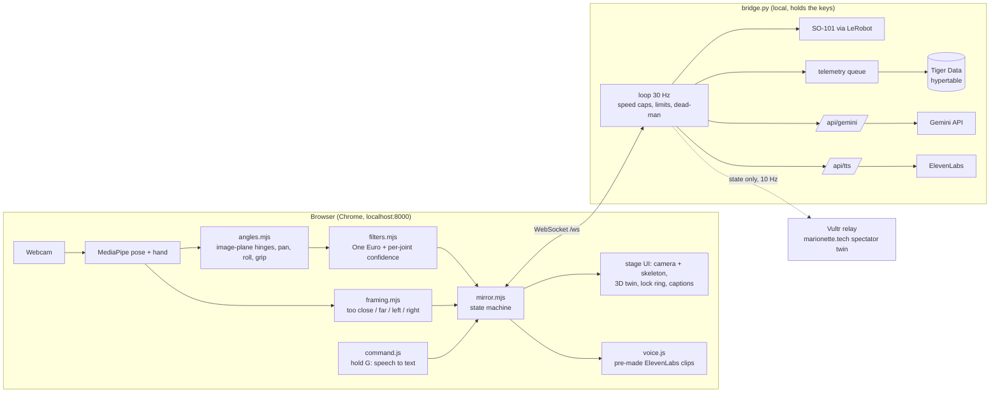

# Marionette Live: architecture (DRAFT for review)

**What it does:** open the site and the robot glides into the goalpost pose. Someone walks up and strikes the same pose, and the robot becomes their arm and mirrors them live. There's no calibration. If they're too close, too far or off to the side, it tells them out loud and on screen. If they walk away, it holds; when they come back, it locks on again by itself.

**Pitch line:** *"Zero calibration: the pose is the handshake."*

## System

Rule: **nothing from the cloud can move the robot.** All API keys live in `marionette/.env`, which is gitignored and read only by the bridge. The spectator relay can receive state but can't send anything back.

## Motion core: why no calibration

- **Fixed reference:** the goalpost pose is the reference for both sides.
  - **Human side:** fixed anatomical numbers (`lift 0` = arm out sideways, `elbow 90`, `pan 0`).
  - **Robot side:** the saved ready pose. Set it once, today, with **Pose by hand**, then **Save as ready**.
- **Captured at lock time:** wrist, roll and grip-open are the noisy ones. We record them during the 1 s lock hold, which the person is doing anyway, so it's still zero clicks.
- **Hinge angles are measured in the image,** in a body frame built from the shoulder line.
  - This works because the hinges' rotation axes point at the camera in this pose.
  - The angles don't change with distance or with where you stand, so the robot "adjusts to you" without rescaling.
- **Pan (base)** uses MediaPipe depth. It gets extra smoothing and a ±5° dead zone. It's the noisiest joint.
- **Mirror:** the arm that makes the goalpost drives. Signs are fixed per installation; test once in twin-only mode and flip `shoulder_pan` or `wrist_roll` if they go the wrong way.
- **Filters:** a One Euro filter per joint, and any jump over 50° in one frame is thrown out. Each joint has its own confidence, and a joint with low confidence holds on its own while the others keep moving.
- **Framing,** measured by shoulder width in the image:
  - **"Step back":** you're too close, or clipped at an edge.
  - **"Come closer":** shoulder width is under 8% of the frame.
  - **"Move left/right":** you're off center.
  - **"Face the camera":** your body is turned more than 25°.

### State machine (`web/mirror.mjs`)

| From | To | When |
|---|---|---|
| BOOT | HOMING | page and WebSocket up, robot connected. Camera starts on its own |
| HOMING | WAITING | robot within 5° of the goalpost |
| WAITING | ACQUIRING | a person is framed OK and tracked well for 300 ms |
| ACQUIRING | MIRRORING | goalpost held for 1 s (ring fills). Robot barely moves because both sides are already at the reference |
| MIRRORING | HOLD | shoulder/elbow tracking lost for more than 400 ms. Robot holds |
| HOLD | REACQUIRE | good tracking back within 10 s |
| REACQUIRE | MIRRORING | same person (similar size and position), gone less than 3 s. Filters reset, 2.5 s smooth blend back |
| REACQUIRE | ACQUIRING | a different person, or gone longer: strike the pose again |
| HOLD | HOMING | nobody back for 10 s. Glide home, then wait |

**Safety upgrades in bridge.py:**
- The bridge gets its own 400 ms dead-man. Today it lives only in the browser.
- The bridge homes when the first page connects.
- `engage` takes a blend time of 1–3 s.
- Speed caps (4°/tick while driving, 1.5°/tick automatic) and limits stay as they are.
- **Esc** = e-stop: disengage and go home.

## UX

- **Layout:**
  - Left 60%: mirrored camera feed with the skeleton drawn over it.
  - Right 40%: the 3D twin. A halo turns green when live.
  - Top: one big instruction line, which doubles as the caption for every voice line.
  - Bottom: robot status, fps, mute.
- **Framing guide:** a dashed goalpost silhouette where you should stand, a far/perfect/close meter, and a lock ring that fills while you hold the pose.
- **What the screen says in each state:**
  - Waiting: "Step up and copy me."
  - Coaching: "Step back", "Come closer", and so on.
  - Ready: "Strike the goalpost."
  - Locked: "Got you. I'm your arm now."
  - Lost: "Come back, I'll wait."
- **Voice (ElevenLabs):** about 15 clips made in advance by `tools/gen_voice.py` and loaded into WebAudio, so there's no delay.
  - A problem must last 700 ms before it's spoken.
  - At least 2.5 s between any two lines, and the same line at most once per 8 s.
  - After two repeats, it's caption only.
- **Demo mode (`?demo`):** fullscreen and resets itself. Keys: Esc e-stop, M mute, R reset, T twin-only. Chrome runs with autoplay allowed so voice works without a click.
- **Accessibility:** every voice line is also a caption, and status uses icon + text + colour. Either arm works, and seated users work.
- **Wow moment:** judge 1 strikes the pose, the ring and robot "click" and it says "Got you". They wave and the robot waves back. They step out, judge 2 steps in, and it locks on with no setup.

## MLH prize tracks

| Track | What we build | Effort |
|---|---|---|
| **ElevenLabs** | Voice coach (above). Live TTS only for Gemini replies | 1 h |
| **Gemini** | Hold G and say "wave", "bow" or "dance". Gemini picks one gesture from a fixed list and writes a one-line reply, which ElevenLabs speaks. Gestures are pre-made keyframes around the ready pose, sent at capped speed, and only when nobody is driving. Gemini never sends joint angles. | 1.5 h |
| **Tiger Data** | Every loop tick (target, measured, speed, tracking) goes into a hypertable, written in batches from a separate task so the 30 Hz loop never waits. A continuous aggregate `per_joint_1s` stores error and peak speed. A `/replay` page plays a session back on the twin (twin only) with lag charts. | 2 h |
| **.Tech** | `marionette.tech` points at the spectator page, or a landing page | 20 min |
| **Vultr** (if ahead) | Read-only spectator relay: the bridge pushes state out at 10 Hz and viewers see the twin. There's no path back to the robot. | 1.5 h |
| Skip | Solana (no real fit), MongoDB (does the same job as Tiger), Backboard (no login flow; only if everything else is done) | |

## Files

- **New in `marionette/web/`:**
  - `mirror.mjs`: state machine.
  - `angles.mjs`: image-plane angles and pan.
  - `filters.mjs`: One Euro filter and confidence.
  - `framing.mjs`: the framing checks.
  - `overlay.js`: silhouette, meter, ring.
  - `voice.js`: clip queue and cooldowns.
  - `command.js`: speech → Gemini → gesture.
  - `replay.html`
- **Other new files:** `tools/gen_voice.py`, `web/voice/*.mp3`, `marionette/telemetry.py`.
- **Changed:**
  - `app.js`: `frame()` calls `mirror.tick`. The Sync wizard is removed, and the flips move to a debug panel.
  - `mapping.mjs`: fixed anatomical reference.
  - `bridge.py`: dead-man, auto-home, `blend_s`, `/api/gemini`, `/api/tts`, telemetry queue.
  - `index.html`: rewritten as the two-panel stage.
  - `requirements.txt`: add python-dotenv, google-genai, elevenlabs, asyncpg.

## 6-hour plan (3 lanes)

| Hour | Lane A: motion (robot person) | Lane B: UX + voice | Lane C: sponsors |
|---|---|---|---|
| 0–1 | Pose robot in goalpost, Save as ready. `angles.mjs` + `filters.mjs` | Stage layout, `framing.mjs`, overlay | Keys in `.env`, `gen_voice.py`, clips |
| 1–2 | `mirror.mjs` + bridge dead-man, auto-home. **Twin-only test, fix signs** | `voice.js`, captions, demo mode | Tiger schema + telemetry writer |
| 2–3 | Engage on real robot, one joint at a time | Lock ring, "Got you" moment | Gemini gestures (`command.js`) |
| 3–4 | Re-acquire + hand-over between people | Polish, reduced motion | `/replay` page, .tech domain |
| 4–4.5 | Integrate everything | | Vultr relay only if green |
| 4.5–6 | **Freeze.** Rehearse the demo 5×, record a backup video, write the Devpost | | |

## Open questions for review

1. Is the goalpost pose the robot's ready pose? Needs power on, the wrist_roll cable untangled, then Pose by hand → Save as ready.
2. Which lanes do Immanuel, Kofi and you each take?
3. Should Gemini gestures be in, or is voice-only coaching enough?
4. Vultr + .tech spectator page: yes or skip?
