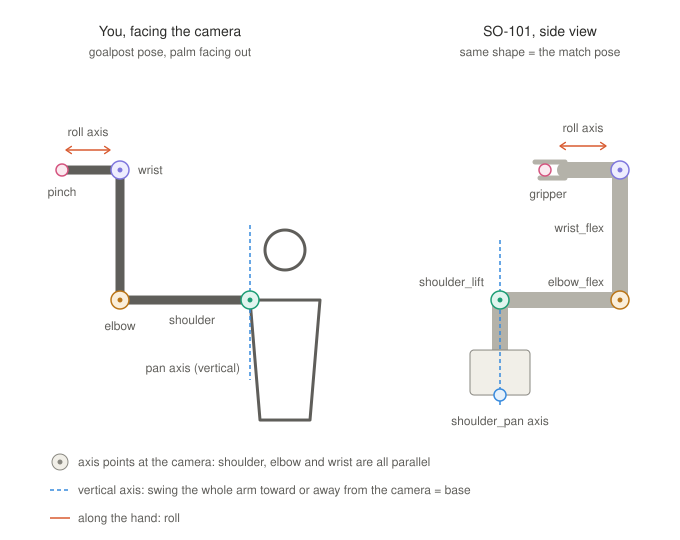

# New matching plan: the goalpost pose

We took two photos: one of a person's arm and one of the SO-101 in the same shape. The upper arm points out sideways, the elbow is bent 90° so the forearm points up, and the wrist is bent 90° so the hand points back across. The robot makes the same shape. That shared pose is our new reference. Everything is measured from it.



## Why this pose

In this pose, the human's shoulder, elbow and wrist hinges all rotate about the same axis, which points straight at the camera. The robot's `shoulder_lift`, `elbow_flex` and `wrist_flex` also share one axis, and it points at the camera too when the robot is viewed from the side. So three of the joints happen in the flat camera image, where MediaPipe is most accurate. We don't need depth for them.

## Joint by joint

| Robot joint | Your motion | Rotation axis (you → robot) | How we measure it |
|---|---|---|---|
| `shoulder_pan` | Swing the whole arm toward or away from the camera | vertical → vertical | Top-view heading of the upper arm: `atan2(dz, dx)` of shoulder→elbow, using MediaPipe world z |
| `shoulder_lift` | Raise or lower the upper arm | at the camera → robot hinge axis | In the image: the angle of shoulder→elbow |
| `elbow_flex` | Bend the elbow | at the camera → robot hinge axis | In the image: the signed angle from upper arm to forearm |
| `wrist_flex` | Bend the hand at the wrist | at the camera → robot hinge axis | In the image: the signed angle from forearm to wrist→middle knuckle |
| `wrist_roll` | Twist the hand | along the hand → along the gripper | Tilt of the knuckle line (landmarks 5→17) around the hand direction |
| `gripper` | Pinch thumb and index | open/close | Tip gap divided by hand size (as now) |

## The math

For each joint:

```
robot = robot_ref + sign × (human − human_ref)      then clip to limits
```

- `human_ref`: your angles captured while you hold the goalpost pose (a new **Match pose** step in Sync).
- `robot_ref`: the robot's actual joint readings in the same pose. Put it there with **Pose by hand**, then press **Save as ready**. We read these angles from the robot, so we don't assume they're 0°.
- `sign`: +1 or −1. Test once by moving each joint and checking the twin. Flip it if it goes the wrong way. The existing flip toggles already store this.

`mapMatchedPose(features, reference, limits, flip)` in `marionette/web/mapping.mjs` already has this shape. The main changes are which pose is the reference and measuring the three hinges in the image plane.

## What changes in the code

1. **app.js `features()`:** compute lift, elbow and wrist_flex as 2D signed angles from image landmarks, not 3D. Keep pan from world coordinates.
2. **Sync:** add a first step, "Hold the goalpost pose". It saves `human_ref`.
3. **bridge.py:** `/api/state` already returns the ready pose. Make the goalpost pose the saved ready pose, so `robot_ref` = ready.
4. **mapping.mjs:** swap the straight-up reference for the captured one. Keep limits, clipping, the 4°/tick speed cap and the 400 ms dead-man as they are.

## Weak spots

- **Pan needs depth.** Toward or away from the camera is the one motion the camera sees worst, so it will be the noisiest joint. Plan: extra smoothing on pan only, plus a ±5° dead zone. Backup plan: stand side-on to the camera for pan.
- **Roll near edge-on:** when the knuckle line points at the camera, the tilt is unreliable. Hold roll when the hand's width in the image drops below about 40% of its captured width.
- **You must face the camera:** if your body turns, the hinge axes stop pointing at the camera. Use the shoulder line (landmarks 11→12) to warn when you rotate more than about 20°.

## Test order

1. Twin only, robot not engaged. Check that each joint moves the right way, and flip any that don't.
2. Engage at the goalpost pose. The robot should barely move, because both are already at the reference.
3. Move one joint at a time, then all together.
