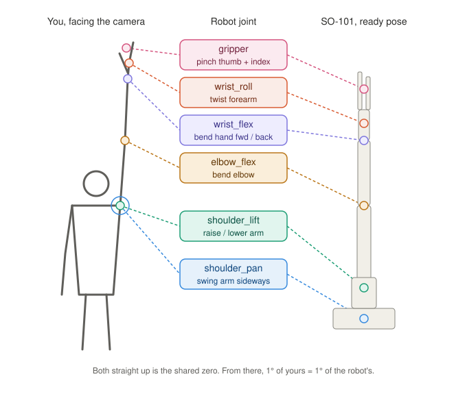
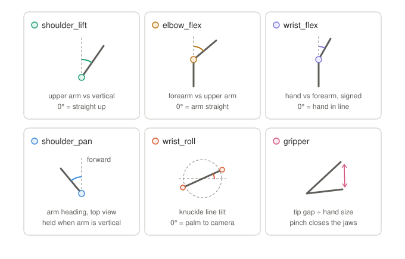

# Research notes: camera teleop for the SO-101

What we learned getting a webcam to drive the SO-101 follower without a leader arm. HackGT 13, 2026-09-26.

## How a leader arm actually drives the follower

We read LeRobot's teleop loop (`lerobot/scripts/lerobot_teleoperate.py`) before replacing the leader. It does nothing clever:

1. `leader.get_action()` reads the 6 leader motor positions: `{"shoulder_pan.pos": 12.3, ..., "gripper.pos": 40}`.
2. `follower.send_action(action)` writes the same numbers as goal positions.
3. Loop.

No inverse kinematics, no unit conversion. Both arms default to `use_degrees=True`, where **0° is the midpoint of each joint's calibrated range** and the gripper is 0–100. So anything that produces those 6 numbers can replace the leader. Marionette's bridge makes exactly that `send_action()` call; the camera is a virtual leader arm.

## Joint matching

| Human | Robot joint | Measured from |
|---|---|---|
| Swing arm across / out | `shoulder_pan` | wrist x offset from shoulder, in shoulder widths (image space) |
| Raise arm | `shoulder_lift` | angle of upper arm from straight down (3D world landmarks) |
| Bend elbow | `elbow_flex` | angle between upper arm and forearm (3D) |
| Bend hand up/down | `wrist_flex` | signed 2D angle between forearm and hand (wrist→middle knuckle) |
| Twist forearm | `wrist_roll` | angle of the knuckle line (index→pinky base) |
| Pinch | `gripper` | thumb–index distance ÷ hand size |

Current mapping is **range sync**: 9 held poses record the user's min/max per feature, which is stretched onto 85% of the robot's calibrated range, with a per-joint flip. It works for anyone without knowing their body, but "your arm straight up" doesn't guarantee "robot straight up".

Proposed next: **angle-for-angle matching.** Use one shared reference (both arms straight up = the robot's ready pose), then map 1° of human joint change to 1° of robot joint change. Engaging then means "raise your arm to match the robot", and the sync shrinks to about 3 poses (to confirm each joint's direction).

### Angle-for-angle design

- **Shared zero:** your arm straight up and the robot's straight-up ready pose both count as 0°. After that, 1° of yours is 1° of the robot's, clipped to its limits.
- **Engage:** raise your arm to match the robot. Control starts only when every joint is within ~10°, so nothing jumps.
- **Pan singularity:** when the upper arm is near vertical its heading is undefined, so the base holds its last value (`mapping.mjs` needs >20% horizontal component).
- **Roll:** from the knuckle-line tilt, still capped at ±147° ([why](#wrist-roll-wrap)).
- **Sync** shrinks to a few poses that only confirm each joint's direction.

Smoothing is an adaptive EMA: a big move gets α up to 0.85 (responsive), jitter gets α ≈ 0.2 (steady).

## Hardware findings

**Flaky USB is the #1 failure.** Symptoms we saw, all fixed by a better cable and not bumping it:
- `Failed to write 'Lock' on id_=5 ... Incorrect status packet`
- `There is no status packet!` on a random motor
- `termios.error: (6, 'Device not configured')`: the port vanished mid-run
- `/dev/tty.usbmodem*` missing entirely

**Moving joints fast during calibration causes errors.** Back-driving the servos quickly by hand generates back-EMF on the bus. Move slowly while recording ranges.

**Telling "no USB" from "no motor power".** If the port exists but a ping to IDs 1–6 at 1 Mbaud returns nothing, the bus has no power. If only one ID is missing, check that motor's cable. The board is a plain USB-serial adapter ("USB Single Serial"), so it has no Wi-Fi of its own.

**The power reading is available.** STS3215 register 62 is voltage in 0.1 V: we read 117, i.e. 11.7 V. It's a quick way to check what the supply really delivers.

**Wrist roll wrap.** The follower rested with wrist roll at 176°, right at the encoder's ±180° wrap. A small command there made the reading jump and the ramp took the long way round: a ~260° spin that wound the gripper cable round the wrist. The motor then stalled against the cable (goal 2047, position 1059, load 20%) and latched **overload (status error bit 5, value 32)**. Writing torque-enable = 0 clears it. Fixes:
- cap wrist roll at ±147° in software
- a self-test that commands each joint 12° and checks it arrived (it caught this: 5 joints passed, wrist roll moved 0°)
- if a joint stalls, turn torque off and untangle by hand

Useful STS3215 registers: 40 torque enable, 42 goal position, 56 present position, 60 present load (bit 10 = direction), 62 voltage, 63 temperature.

## Software gotchas

- **mediapipe 1.0.x** removed `mp.solutions`, and its Tasks API crashed on macOS (`graph_service.h Check failed: service_`). **mediapipe 0.10.21 works.** The browser uses `@mediapipe/tasks-vision@0.10.21`.
- MediaPipe's handedness labels assume a mirrored selfie image; on a raw frame your right hand is labelled "Left". The web app ignores the label and picks the hand whose wrist sits on the tracked arm's wrist.
- LeRobot's startup broadcast ping sometimes misses one motor even when individual pings succeed; the bridge retries the connection 3 times.
- Browsers only allow the camera on `localhost` or HTTPS. A phone on the LAN needs a tunnel or a certificate.
- The old docs' `lerobot/scripts/control_robot.py` no longer exists; use `lerobot-calibrate`, `lerobot-teleoperate`, `lerobot-find-port`.

## Safety design

- **Speed caps** in the bridge: 4°/tick at 30 Hz (120°/s) while driving, 1.5°/tick (45°/s) for automatic moves; gripper 3×.
- **Soft engage**: engaging blends from the robot's current pose to the user's with a 1.5 s smoothstep, so there is no jump.
- **Dead-man**: if tracking is lost for 400 ms, the page stops sending targets and the robot holds. All clients gone → hold.
- **Ready pose on connect**: the arm always starts from a known pose.
- **Remote access needs a key**; localhost does not.

## Untethered / over the internet

Only joint angles travel (6 numbers, 30 Hz), so Wi-Fi is plenty. The servo board can't do Wi-Fi, so something has to sit next to the arm:

| Option | Work | Notes |
|---|---|---|
| Laptop + tunnel (cloudflared/ngrok) | none | HTTPS link also fixes the phone-camera restriction |
| Raspberry Pi (Zero 2 W / 4 / 5) on the board's USB | ~30 min setup | runs `bridge.py` unchanged; start it at boot |
| ESP32 bus-servo driver (e.g. Waveshare) replacing the board | new firmware | fully wireless; bridge could run in the cloud and send raw goal ticks |
